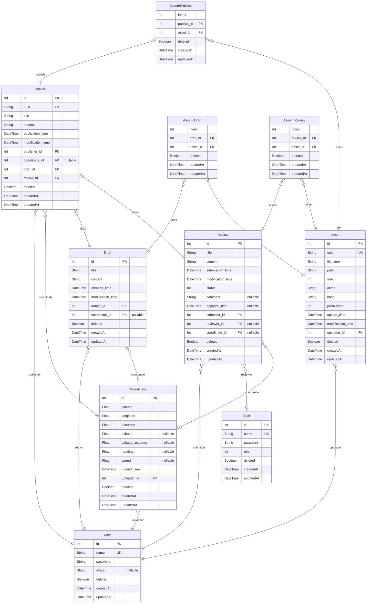

# 旅行日记 | Travel Diary

> Generated by [`prisma-markdown`](https://github.com/samchon/prisma-markdown)

-   [Server](#server)

## Server

### `Staff`

平台管理人员 | Platform managers

**Properties**

-   `id`: 主键 | Primary Key
-   `name`: 账户用户名 | Account Username
-   `password`
    > 账户密码 | Account password
    > 格式: 十六进制字符串 | Format: Hex string
-   `role`
    > 账户权限 | Account permission
    >
    > -   `0`: 管理员 | Administrator
    > -   `1`: 审核员 | Reviewer
-   `deleted`: 是否已逻辑删除 | Whether it has been logically deleted
-   `createdAt`: 记录创建时间 | Record creation time
-   `updatedAt`: 记录更新时间 | Record update time

### `User`

平台用户 | Platform users

**Properties**

-   `id`: 主键 | Primary Key
-   `name`: 账户用户名 | Account Username
-   `password`
    > 账户密码 | Account password
    > 格式: 十六进制字符串 | Format: Hex string
-   `avatar`
    > 用户头像 | User avatar
    >
    > -   `NULL`: 使用默认头像 | Use the default avatar
    > -   `String`: 头像文件的 UUID | UUID of the avatar file
-   `deleted`: 是否已逻辑删除 | Whether it has been logically deleted
-   `createdAt`: 记录创建时间 | Record creation time
-   `updatedAt`: 记录更新时间 | Record update time

### `Draft`

旅行日记的草稿 | Draft of travel diary

**Properties**

-   `id`: 主键 | Primary Key
-   `title`: 草稿标题 | Draft title
-   `content`: 草稿内容 | Draft content
-   `creation_time`: 草稿创建时间 | Draft creation time
-   `modification_time`: 草稿修改时间 | Draft modification time
-   `author_id`: 作者 ID | Author ID
-   `coordinate_id`: 位置 ID | Coordinate ID
-   `deleted`: 是否已逻辑删除 | Whether it has been logically deleted
-   `createdAt`: 记录创建时间 | Record creation time
-   `updatedAt`: 记录更新时间 | Record update time

### `Review`

旅行日记的审批项 | Approval item of travel diary

**Properties**

-   `id`: 主键 | Primary Key
-   `title`: 标题 | Title
-   `content`: 内容 | Content
-   `submission_time`: 提交时间 | Submission time
-   `modification_time`: 修改时间 | Modification time
-   `status`
    > 审批状态 | Approval status
    >
    > -   `0`: 待审核 (默认) | Pending review (default)
    > -   `1`: 已通过 | Passed
    > -   `2`: 未通过 | Failed
    > -   `3`: 已取消 | Canceled
-   `comment`: 审议意见 | Review comments
-   `approval_time`: 审议时间 | Review time
-   `submitter_id`: 提交者 ID | Submitter ID
-   `reviewer_id`: 审议者 ID | Reviewer ID
-   `coordinate_id`: 位置 ID | Coordinate ID
-   `deleted`: 是否已逻辑删除 | Whether it has been logically deleted
-   `createdAt`: 记录创建时间 | Record creation time
-   `updatedAt`: 记录更新时间 | Record update time

### `Publish`

已发布的旅行日记 | Published travel diary

**Properties**

-   `id`: 主键 | Primary Key
-   `uuid`: 用于路由的 UUID | UUID for routing
-   `title`: 标题 | Title
-   `content`: 内容 | Content
-   `publication_time`: 发布时间 | Publication time
-   `modification_time`: 修改时间 | Modification time
-   `publisher_id`: 发布者 ID | Publisher ID
-   `coordinate_id`: 位置 ID | Coordinate ID
-   `draft_id`: 草稿 ID | Draft ID
-   `review_id`: 审议项 ID | Review item ID
-   `deleted`: 是否已逻辑删除 | Whether it has been logically deleted
-   `createdAt`: 记录创建时间 | Record creation time
-   `updatedAt`: 记录更新时间 | Record update time

### `Asset`

用户上传的资源文件 | Resource files uploaded by users
头像, 照片等 | Avatar, photo etc.

**Properties**

-   `id`: 主键 | Primary Key
-   `uuid`: 用于路由的 UUID | UUID for routing
-   `filename`: 文件名 | File name
-   `path`: 文件保存路径 | File save path
-   `size`
    > 文件大小 | File size
    > 单位: 字节 (Byte) | Unit: byte
-   `mime`
    > 文件 MIME 类型 | File MIME type
    > [https://developer.mozilla.org/zh-CN/docs/Web/HTTP/Basics_of_HTTP/MIME_types](#https://developer)
-   `hash`
    > 文件摘要 | File digest
    > 摘要算法: SHA-128 | Digest algorithm: SHA-128
    > 格式: 十六进制字符串 | Format: Hex string
-   `permission`
    > 访问权限 | Access permission
    >
    > -   `0b0001`: 上传者可访问 | Accessible to the uploader
    > -   `0b0010`: 审核者可访问 | Accessible to the reviewer
    > -   `0b0100`: 管理员可访问 | Accessible to the administrator
    > -   `0b1000`: 公开访问 | Public access
-   `upload_time`: 上传时间 | Upload time
-   `modification_time`: 更改时间 | Modification time
-   `uploader_id`: 上传者 ID | Uploader ID
-   `deleted`: 是否已逻辑删除 | Whether it has been logically deleted
-   `createdAt`: 记录创建时间 | Record creation time
-   `updatedAt`: 记录更新时间 | Record update time

### `AssetInDraft`

草稿中的资源 | Assets in draft

**Properties**

-   `index`
    > 排序序号 | Sort order number
    > 升序排列 | Ascending order
-   `draft_id`: 草稿 ID | Draft ID
-   `asset_id`: 资源 ID | Asset ID
-   `deleted`: 是否已逻辑删除 | Whether it has been logically deleted
-   `createdAt`: 记录创建时间 | Record creation time
-   `updatedAt`: 记录更新时间 | Record update time

### `AssetInReview`

审议项中的资源 | Assets in review

**Properties**

-   `index`
    > 排序序号 | Sort order number
    > 升序排列 | Ascending order
-   `review_id`: 审议项 ID | Review ID
-   `asset_id`: 资源 ID | Asset ID
-   `deleted`: 是否已逻辑删除 | Whether it has been logically deleted
-   `createdAt`: 记录创建时间 | Record creation time
-   `updatedAt`: 记录更新时间 | Record update time

### `AssetInPublish`

已发布内容中的资源 | Assets in publish

**Properties**

-   `index`:
-   `publish_id`: 已发布内容 ID | Publish ID
-   `asset_id`: 资源 ID | Asset ID
-   `deleted`: 是否已逻辑删除 | Whether it has been logically deleted
-   `createdAt`: 记录创建时间 | Record creation time
-   `updatedAt`: 记录更新时间 | Record update time

### `Coordinate`

位置信息 | Location information

**Properties**

-   `id`: 主键 | Primary Key
-   `latitude`
    > 纬度 | Latitude
    > 单位: 度 (°) | Unit: degree (°)
-   `longitude`
    > 经度 | Longitude
    > 单位: 度 (°) | Unit: degree (°)
-   `accuracy`
    > 经纬度的精确度 | Accuracy of latitude and longitude
    > 单位: 度 (°) | Unit: degree (°)
    > 95% 置信区间 | 95% confidence interval
-   `altitude`
    > 海拔高度 | Altitude
    > 单位: 米 (m) | Unit: meter (m)
-   `altitude_accuracy`
    > 海拔高度的精确度 | Accuracy of altitude
    > 单位: 米 (m) | Unit: meter (m)
    > 95% 置信区间 | 95% confidence interval
-   `heading`
    > 方向 | Heading
    > 单位: 度 (°) | Unit: degree (°)
    >
    > -   `0`: 正北方向 | Due north
    > -   `90`: 正东方向 | Due east
    > -   `180`: 正南方向 | Due south
    > -   `270`: 正西方向 | Due west
-   `speed`:
-   `upload_time`: 上传时间 | Upload time
-   `uploader_id`: 上传者 ID | Upload ID
-   `deleted`: 是否已逻辑删除 | Whether it has been logically deleted
-   `createdAt`: 记录创建时间 | Record creation time
-   `updatedAt`: 记录更新时间 | Record update time
